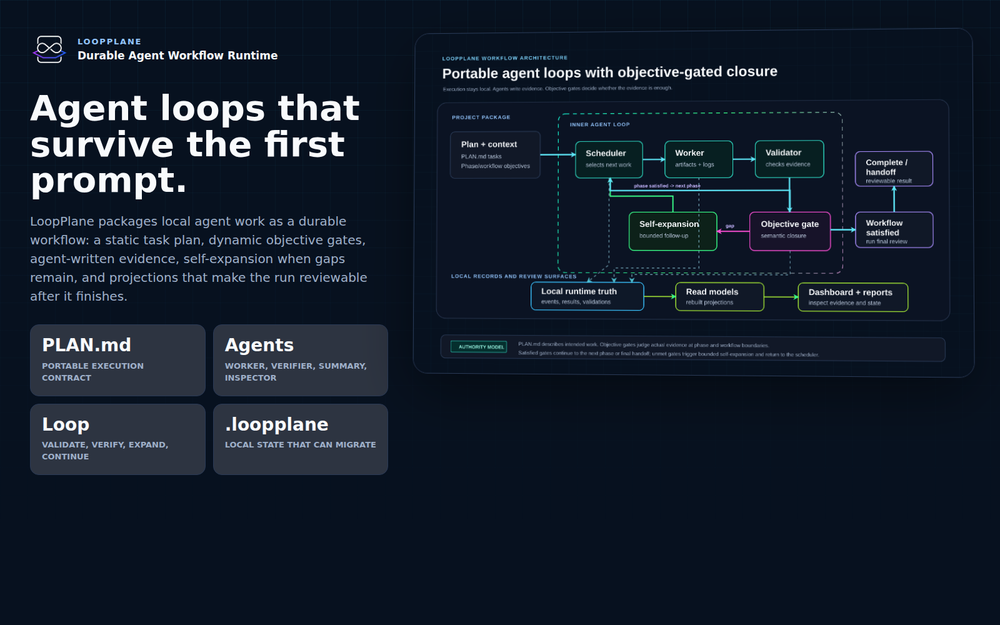
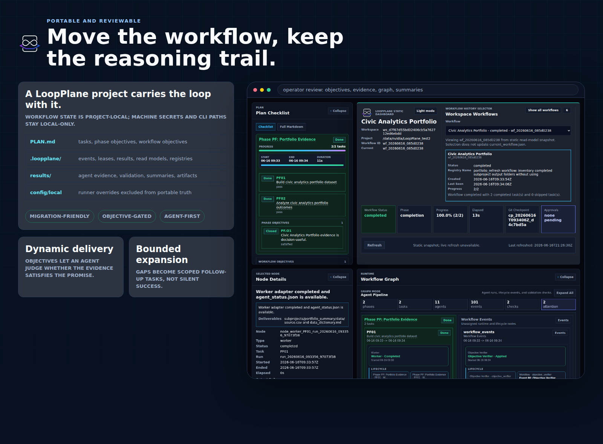
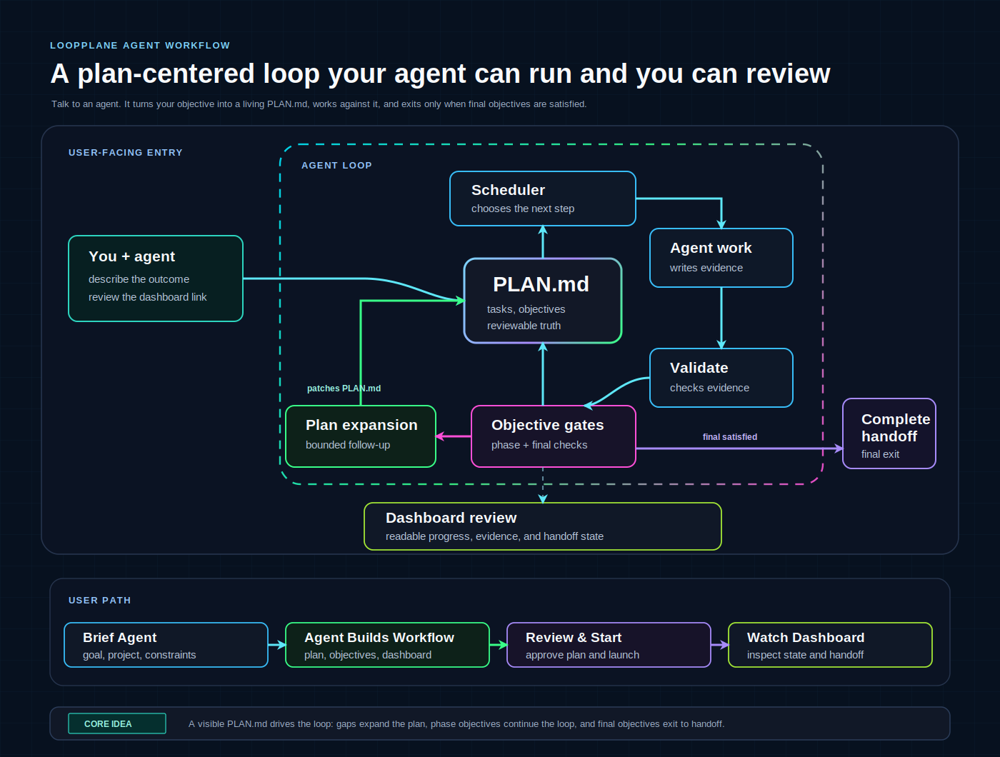
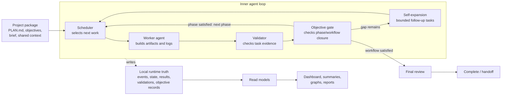
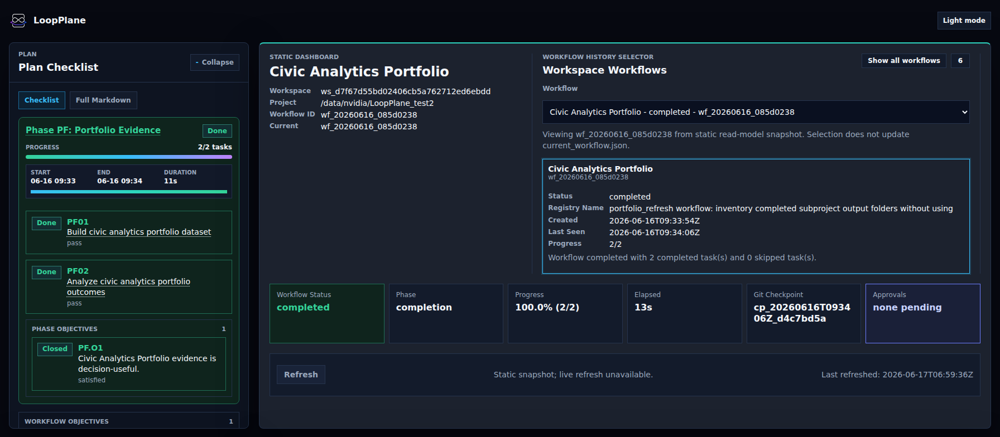
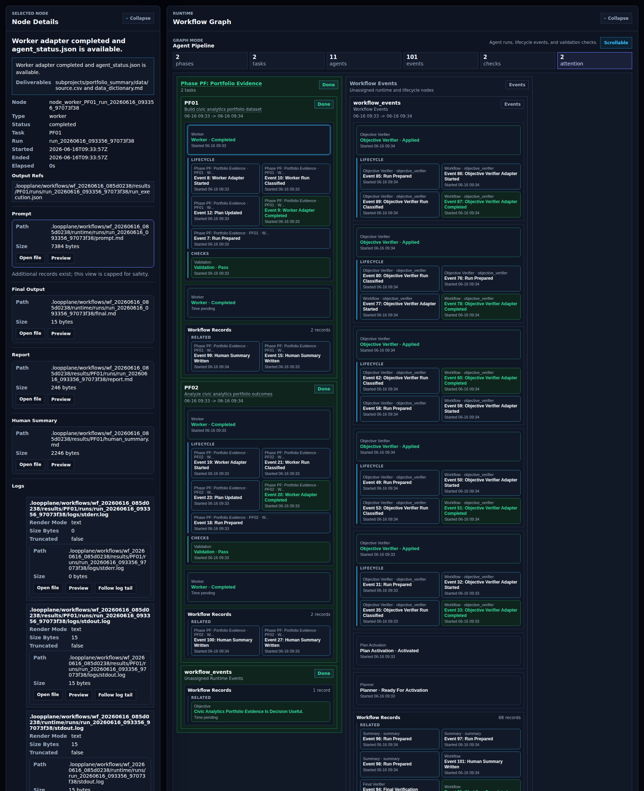

# LoopPlane Showcase

LoopPlane is a local runtime for durable agent workflows. It helps an external
coding agent turn a user request into a project-local workflow with a plan,
evidence, validation records, objective checks, summaries, and dashboard views
that remain available after the agent run finishes.

## Overview

LoopPlane is designed for work that should continue beyond a single prompt. A
workflow keeps its plan, runtime state, agent evidence, validation results,
objective reports, expansion history, summaries, and review views together in
the project. This makes the work easier to inspect, resume, migrate, or hand off.

| Layer | What It Provides |
| --- | --- |
| Plan | `PLAN.md` describes phases, tasks, dependencies, validation hints, and high-level objectives. |
| Runtime records | `.loopplane/` stores events, state, leases, results, validations, objective reports, and expansion history. |
| Agent roles | Worker, validator, objective verifier, summary, inspector, reviewer, and expansion planner roles can inherit the configured runner. |
| Objective gates | Phase and workflow objectives are checked against actual evidence instead of assumed from task completion alone. |
| Self-expansion | When an objective is not satisfied, LoopPlane can ask an agent to propose bounded follow-up work. |
| Review surfaces | The dashboard, graph, summaries, and reports expose workflow state without replacing the underlying records. |

## Portable And Reviewable

LoopPlane separates portable workflow truth from machine-local setup. The
workflow package carries the plan, evidence, objective closure records, read
models, and review artifacts. Local CLI paths, credentials, locks, and dashboard
tokens stay machine-local.

The dashboard is a read and control surface over those records. It lets users
inspect task progress, objectives, evidence, graph history, summaries, approvals,
runner state, and workflow history without reading every runtime file by hand.

## Workflow Architecture

The static plan describes intended work. The runtime loop selects tasks, runs
agents, validates evidence, and checks high-level objectives at phase and
workflow boundaries. If a phase objective is satisfied, scheduling continues to
the next phase. If a workflow objective is satisfied, the run moves toward final
review and handoff. If an objective gap remains, self-expansion can add scoped
follow-up tasks and return control to the scheduler.

## Capabilities

- Durable task execution with scheduler state, run leases, and append-only
  runtime events.
- Agent-authored evidence stored with validation reports and result pointers.
- Phase and workflow objective gates checked by an agent against current
  evidence.
- Bounded self-expansion when an objective gap can be turned into follow-up work.
- Human-readable summaries that can include task-specific tables, figures,
  artifact links, and residual-risk notes.
- Local runner overrides that keep machine-specific CLI paths and credentials
  outside portable workflow truth.
- Dashboard and static read models for inspecting progress, evidence, summaries,
  graph relationships, and workflow history.

## Example Dashboard Surface

The dashboard is intended for review and operation. It shows the current plan,
objective states, task evidence, workflow graph, summary content, approvals,
runtime health, and registered workflow histories. The first view pairs the
active plan with the workflow dashboard. The second view pairs selected-node
evidence with an expanded runtime graph so the agent pipeline is easier to
inspect. The source of truth remains the project-local workflow records; the
dashboard is a projection over those records.

## Design Summary

LoopPlane combines a static execution plan with dynamic agent judgment:

- Tasks define the intended work.
- Objectives define the higher-level delivery standard.
- Worker output is treated as evidence, not as automatic completion.
- Objective verifiers decide whether that evidence satisfies the phase or
  workflow objective.
- Self-expansion is available when the current work is not enough but the gap is
  actionable.
- Users can inspect the run through dashboard views and summary artifacts while
  the local records remain auditable.

This makes LoopPlane useful for projects where agent work needs to be resumable,
reviewable, and portable rather than tied to one chat session.
