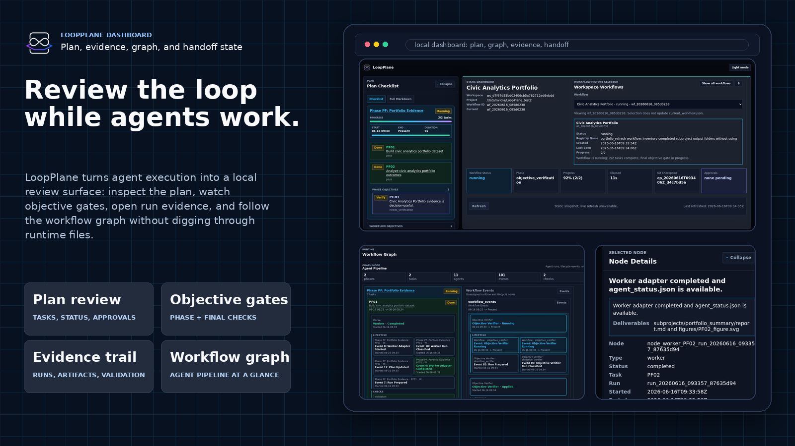
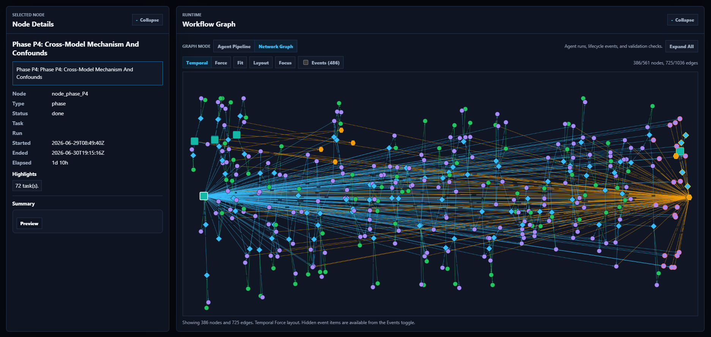
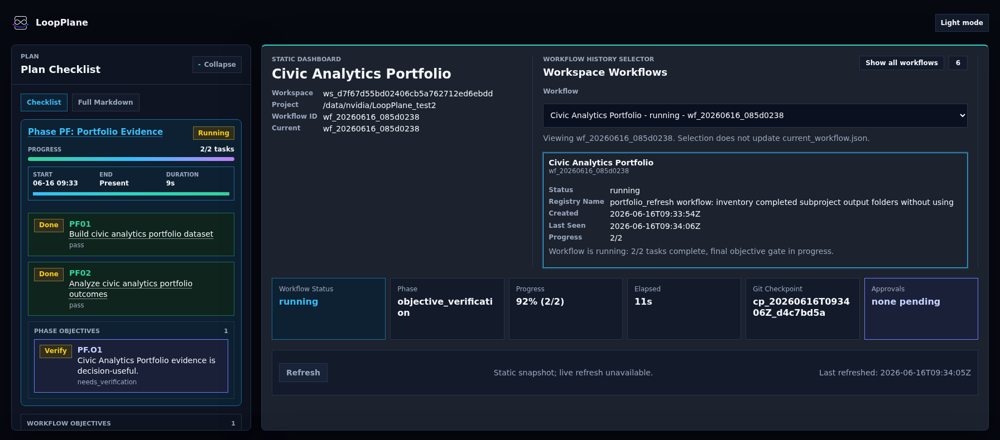
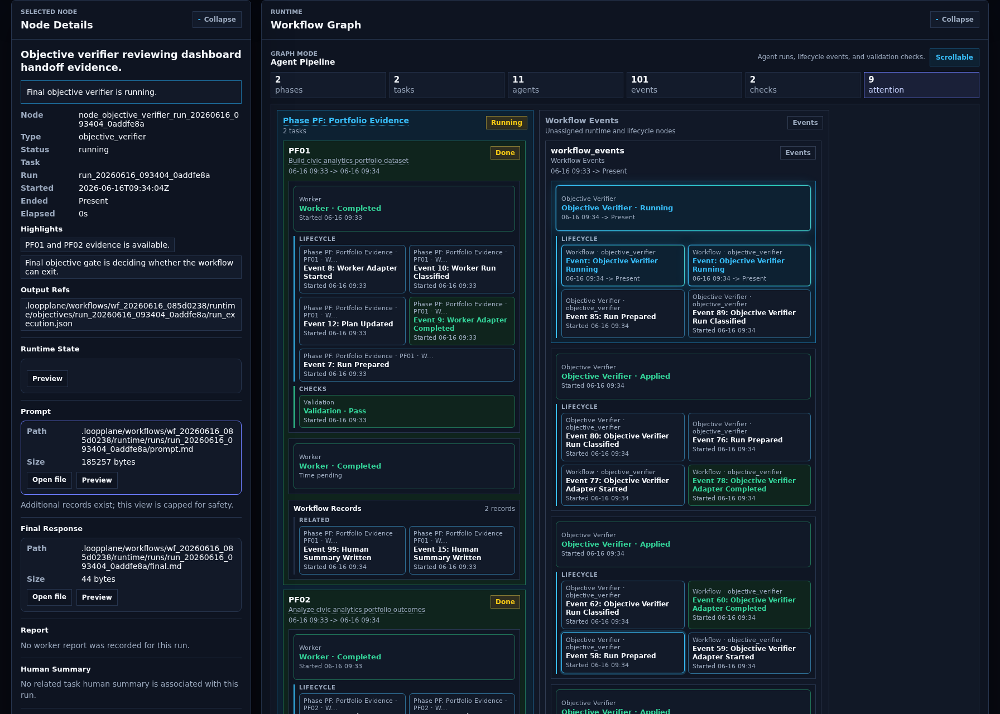

<p align="center">
  <picture>
    <source media="(prefers-color-scheme: dark)" srcset="artifacts/showcase/loopplane_logo_dark.png" />
    <source media="(prefers-color-scheme: light)" srcset="artifacts/showcase/loopplane_logo_light.png" />
    
  </picture>
</p>

<h1 align="center">LoopPlane</h1>

<p align="center">
  Durable local workflows for coding agents.
</p>

<p align="center">
  
  
  
</p>

---

LoopPlane helps Codex CLI, Claude Code, and other external coding agents turn a
brief into a project-local workflow with a plan, evidence, validation records,
objective checks, Git checkpoints, and dashboard views.

Use it when agent work should be reviewable, resumable, and portable instead of
being trapped inside one chat session.






## Why LoopPlane

Long-running agent work needs more structure than a single prompt can provide.
LoopPlane gives that work a local control surface:

| Need | LoopPlane Surface |
| --- | --- |
| Review the intended work | `PLAN.md`, planning reports, and audit reports |
| Inspect what happened | runtime events, run directories, logs, and evidence |
| Trust completion | validation, reconciliation, objective gates, and final verification |
| Recover or resume | scheduler state, detached supervisor metadata, control requests |
| Keep work portable | project-local `.loopplane/` truth with machine-local runner overrides |
| Watch progress | static or token-protected local dashboard views |

LoopPlane is local-first. Project workflow truth lives in the target project;
CLI paths, credentials, dashboard tokens, and local discovery records stay
machine-local.

## When To Use It

LoopPlane is useful when:

- a coding-agent task spans many steps or multiple prompts;
- you want a plan before execution starts;
- evidence and validation matter;
- you need pause, resume, status, logs, or dashboard inspection;
- agent work should leave a reviewable record in the project;
- you want to hand work between Codex CLI, Claude Code, or other runner
  adapters.

It is not a model provider, hosted agent platform, or replacement for a coding
agent. It is the local runtime and record layer around agent work.

## Start With Your Agent

LoopPlane is meant to be operated by a coding agent, not by a human manually
typing every LoopPlane command. Your job is to describe the project and review
the plan; the agent should install or attach LoopPlane, configure runners,
build the workflow, set objectives, and give you a dashboard link.

Start simple: paste only the project path and desired outcome. Add optional
context when the work has important references, stop rules, resource limits, or
quality gates.

```text
Use LoopPlane to set up a durable workflow for this project.

Project:
<PROJECT_DIR>

Outcome:
<DESCRIBE_THE_RESULT_I_WANT_OR_LINK_TO_REQUIREMENTS>

Optional context, add only what matters:
- LoopPlane source: <PATH_OR_INSTALL_METHOD_IF_NEEDED>
- Workflow mode: review-gated planning first; do not start execution until I approve
- Runner preference: <AUTO_DISCOVER_OR_PREFERRED_AGENT_CLI>
- Important references: <FILES_OR_DIRECTORIES_TO_READ_BEFORE_PLANNING>
- Shared context: <CONSTRAINTS_GUIDELINES_OR_DECISIONS_WORKERS_MUST_INHERIT>
- Objective gates: <HOW_PHASES_AND_FINAL_SUCCESS_SHOULD_BE_VERIFIED>
- Self-expansion budget: <WHEN_TO_ADD_TASKS_OR_PHASES_IF_GATES_FAIL>
- Operating constraints: <ENVIRONMENT_LIMITS_RESOURCES_APPROVALS_OR_REPORTING>

Treat yourself as the LoopPlane workflow builder and operator, not as a user
asking me to run CLI commands. Install or attach LoopPlane in the target
project, inspect the files, discover and configure available Codex CLI or
Claude Code runners, and run runner diagnostics.

Before drafting the plan, read the important references and write the relevant
requirements, constraints, and decisions into shared context so future workers
inherit them.

Create a LoopPlane workflow from this outcome and context. Write a concrete
plan with reviewable tasks, validation criteria, phase objectives, and final
objectives. If the plan would not satisfy the objective gates, design task or
phase expansion rather than treating weak results as the end of the workflow.
Run the planner/auditor loop until the plan draft is ready.

Start or render the dashboard and give me the dashboard URL or path. Stop before
activating or starting execution so I can review the plan and objectives first.

At the end, summarize:
- configured runner CLIs
- shared context path and required references captured there
- plan draft path
- dashboard URL or dashboard path
- phase and final objectives
- self-expansion and stop rules
- any questions that truly block activation
```

After you review the dashboard and plan, send a second short prompt:

```text
The LoopPlane plan looks ready. Activate the approved plan, start the workflow
in detached/background mode, keep the dashboard available, follow the approved
objective gates and self-expansion rules, and monitor long enough to confirm the
workflow is running. Report the dashboard URL and current progress.
```

For a fuller prompt library, including status updates, plan changes, new
workflow histories, pause, and stop requests, use
[`README_FOR_HUMANS.md`](README_FOR_HUMANS.md).

## What To Expect

Your agent should do the LoopPlane mechanics for you:

1. Install or attach LoopPlane in the target project.
2. Configure installed and authenticated Codex CLI or Claude Code runners.
3. Turn your outcome and optional context into `PROJECT_BRIEF.md`, shared
   context, and a plan draft.
4. Capture required reading, constraints, and inherited decisions in shared
   context for future workers.
5. Add task validation criteria, phase objectives, final objective gates,
   self-expansion rules, and stop rules.
6. Build or start a dashboard and give you the URL or static path.
7. Wait for your review before activating the plan.
8. Start the workflow only after approval unless you explicitly requested a
   fully autonomous mode.
9. Keep evidence, validations, objective reports, Git checkpoints, status, and
   dashboard projections available for inspection.

If runner diagnostics report `*_waiting_config` or
`runner_readiness: waiting_config`, the agent should resolve CLI discovery,
authentication, or runner configuration before planning or starting execution.

## Agent Operator Notes

Human users can usually skip this section. These commands are the kind of work
your agent should perform while setting up a provider-backed LoopPlane workflow.

Initialize the workflow:

```bash
python3 scripts/loopplane init --project "$PROJECT" --brief "$USER_REQUIREMENTS"
```

Configure Codex CLI runners when Codex is available:

```bash
python3 scripts/loopplane configure-agent --project "$PROJECT" --runner worker --role worker --adapter codex_cli --command codex
python3 scripts/loopplane configure-agent --project "$PROJECT" --runner planner --role planner --adapter codex_cli --command codex
python3 scripts/loopplane configure-agent --project "$PROJECT" --runner auditor --role auditor --adapter codex_cli --command codex
python3 scripts/loopplane doctor-agent --project "$PROJECT" --runner worker
python3 scripts/loopplane doctor-agent --project "$PROJECT" --runner planner
python3 scripts/loopplane doctor-agent --project "$PROJECT" --runner auditor
```

Configure Claude Code when Claude is the available runner:

```bash
CLAUDE_BIN="$(command -v claude)"
python3 scripts/loopplane configure-agent --project "$PROJECT" --runner worker --role worker --adapter claude_code_cli --command "$CLAUDE_BIN"
python3 scripts/loopplane doctor-agent --project "$PROJECT" --runner worker
```

Create the plan and dashboard for user review:

```bash
python3 scripts/loopplane plan --project "$PROJECT"
python3 scripts/loopplane audit-plan --project "$PROJECT"
python3 scripts/loopplane dashboard --project "$PROJECT" --port auto
```

After the user approves the plan:

```bash
python3 scripts/loopplane activate-plan --project "$PROJECT"
python3 scripts/loopplane start --project "$PROJECT" --detach
python3 scripts/loopplane status --project "$PROJECT"
```

For full provider-backed validation, use installed and authenticated
`codex_cli` or `claude_code_cli` runners. The local smoke fixtures below are
only for package validation.

## Dashboard

LoopPlane can render an offline dashboard bundle or start a token-protected
local server. The dashboard projects workflow truth into views for plan status,
objective state, runs, evidence, Git checkpoints, requests, approvals, runner
configuration, and workflow history.





Static snapshot:

```bash
python3 scripts/loopplane dashboard --project "$PROJECT" --rebuild-read-models
```

Local server with automatic port selection:

```bash
python3 scripts/loopplane dashboard --project "$PROJECT" --port auto
```

See [`dashboard/README.md`](dashboard/README.md) for dashboard API, security,
freshness, and workflow-switching details.

## How It Works


LoopPlane is a plan-centered workflow for agentic work:

1. You ask an agent to use LoopPlane for a concrete outcome.
2. The agent turns the conversation into brief, shared context, and an audited
   `PLAN.md`.
3. The loop schedules from `PLAN.md`, runs agent work, records evidence, and
   validates the result.
4. Objective gates check phase objectives and final workflow objectives.
5. If a gate finds a gap, the same loop expands the plan with bounded follow-up
   work, then continues from the updated `PLAN.md`.
6. If phase objectives are satisfied, the loop advances to the next planned
   work; if final objectives are satisfied, it exits to completion and handoff.
7. The dashboard gives you a readable review surface over the plan, evidence,
   and handoff state.

The important product idea is simple: the agent works inside a visible plan, so
progress, gaps, and completion are reviewable instead of disappearing into a
chat transcript.

## Documentation

| Need | Start Here |
| --- | --- |
| Product overview | [`LOOPPLANE_SHOWCASE.md`](LOOPPLANE_SHOWCASE.md) |
| Non-CLI copy-paste prompts | [`README_FOR_HUMANS.md`](README_FOR_HUMANS.md) |
| Local smoke example | [`examples/minimal_project/README.md`](examples/minimal_project/README.md) |
| Runtime status | [`STATUS.md`](STATUS.md) |
| Authoritative specification | [`LoopPlane.md`](LoopPlane.md) |
| Protocol references | [`references/README.md`](references/README.md) |
| CLI surface | [`scripts/README.md`](scripts/README.md) |
| Runtime internals | [`runtime/README.md`](runtime/README.md) |
| Adapter contracts | [`runtime/adapters/README.md`](runtime/adapters/README.md) |
| Dashboard details | [`dashboard/README.md`](dashboard/README.md) |
| Workflow templates | [`templates/workflows/README.md`](templates/workflows/README.md) |

## Project Status

The current package version is `1.6.0`. The standalone runtime implements the
local MVP surface: real Codex CLI and Claude Code adapters, detached execution,
validation and reconciliation, objective gates, final verification, dashboard
views, workflow history, migration export/import, and Git checkpoint helpers.

See [`STATUS.md`](STATUS.md) for implemented v1.6 support, intentionally
deferred scope, smoke-fixture boundaries, and release validation commands.

### Release Gate Status

Completed standalone/MVP functionality includes real `codex_cli` and
`claude_code_cli` adapter execution, detached supervisor-backed runtime,
skill doctor/install/update/pack workflows, `write-brief`, local Git checkpoint
and `vc` inspection/rollback commands, read-model rebuilds, static and
token-protected server dashboard modes, request-record dashboard controls,
inspector chat/change requests, workspace-scoped `dashboard list` inspection,
validation, reconciliation, final verification, and release gates that block
unfinished required command and adapter surfaces.

### v1.6 Support Status

Implemented v1.6 support includes same-workspace workflow history, dashboard
workflow switching, workspace registry/current pointer support, v1.5 flat
compatibility, project-local `.loopplane/workspace.json`,
`.loopplane/workflow_registry.json`, and `.loopplane/current_workflow.json`
metadata, canonical v1.6 workflow-root mode under
`.loopplane/workflows/<workflow_id>/`, workspace and workflow CLI groups,
LOOPPLANE_HOME discovery and local override support, Runner resource locks,
Monorepo and nested workspace boundaries, Migration export/import profiles,
Git-ref bundle export/import, archived/read-only workflow mutation safeguards,
and Release gates for those surfaces.

Optional behavior allowed by the spec but not required for the current core
runtime includes multiple active-running workflows in one workspace, global
cross-workspace dashboard discovery, parallel workers, cloud or orchestration
backends, advanced graph editing, complex cost accounting, multi-user dashboard
authentication, and remote browser collaboration.

Smoke and fixture paths are intentionally narrower than the full
provider-backed flow. `noop`, `shell`, fake `codex`/`claude` test binaries,
planner/auditor-disabled flows, and offline/static dashboard bundles are for
local smoke, fixture, or read-only validation; they do not replace installed
and authenticated provider-backed execution.

## Command Reference

Common commands:

| Command | Purpose |
| --- | --- |
| `python3 scripts/loopplane --help` | Show the CLI surface |
| `python3 scripts/loopplane init --project <project> --brief "..."` | Create a project-local workflow |
| `python3 scripts/loopplane configure-agent --project <project> ...` | Configure local runner commands |
| `python3 scripts/loopplane doctor-agent --project <project> --runner <runner>` | Check runner readiness |
| `python3 scripts/loopplane plan --project <project>` | Generate a plan draft |
| `python3 scripts/loopplane audit-plan --project <project>` | Audit the draft |
| `python3 scripts/loopplane activate-plan --project <project>` | Promote the draft to active `PLAN.md` |
| `python3 scripts/loopplane start --project <project> --detach` | Start the detached runtime |
| `python3 scripts/loopplane status --project <project>` | Inspect workflow status |
| `python3 scripts/loopplane logs --project <project>` | Inspect recent events and logs |
| `python3 scripts/loopplane dashboard --project <project> --port auto` | Start the local dashboard server |
| `python3 scripts/loopplane health --project <project>` | Run runtime health checks |
| `python3 scripts/loopplane final-verify --project <project>` | Run final completion gates |

Detailed command groups are documented in [`scripts/README.md`](scripts/README.md).

## Maintainer Smoke Test

This deterministic path is an offline release smoke built from smoke fixtures,
not production agent substitutes. It uses `noop` and `shell`, plus deterministic
objective reports, so maintainers can verify the package without external agent
credentials. It does not replace installed and authenticated provider-backed
execution with real `codex_cli` or `claude_code_cli` runners.

Run from the repository root:

```bash
PROJECT="$(mktemp -d /tmp/loopplane-minimal-example.XXXXXX)"
export LOOPPLANE_HOME="$(mktemp -d /tmp/loopplane-home.XXXXXX)"
python3 scripts/loopplane init --project "$PROJECT" --brief "Run the minimal LoopPlane example."
python3 scripts/loopplane configure-agent --project "$PROJECT" --runner planner --role planner --adapter noop --command noop
python3 scripts/loopplane configure-agent --project "$PROJECT" --runner auditor --role auditor --adapter noop --command noop
python3 scripts/loopplane doctor-agent --project "$PROJECT" --runner planner
python3 scripts/loopplane plan --project "$PROJECT"
python3 scripts/loopplane audit-plan --project "$PROJECT"
python3 scripts/loopplane activate-plan --project "$PROJECT"
python3 examples/minimal_project/write_smoke_plan.py "$PROJECT"
WORKER="$(pwd)/examples/minimal_project/worker.py"
python3 scripts/loopplane configure-agent --project "$PROJECT" --runner worker --role worker --adapter shell --command "python3 $WORKER"
python3 scripts/loopplane preview --project "$PROJECT"
python3 scripts/loopplane run --project "$PROJECT" --max-ticks 1
RUN_DIR=$(find "$PROJECT/.loopplane" -path '*/results/T001/runs/run_*' -type d -name 'run_*' | sort | tail -n 1)
python3 scripts/loopplane validate --project "$PROJECT" --task T001 --run-dir "$RUN_DIR"
python3 scripts/loopplane reconcile --project "$PROJECT" --task T001 --run-dir "$RUN_DIR"
python3 examples/minimal_project/write_smoke_objective_reports.py "$PROJECT"
python3 scripts/loopplane rebuild-read-models --project "$PROJECT"
python3 scripts/loopplane dashboard --project "$PROJECT" --rebuild-read-models
python3 scripts/loopplane health --project "$PROJECT"
python3 scripts/loopplane vc doctor --project "$PROJECT"
python3 scripts/loopplane final-verify --project "$PROJECT"
```

Expected result:

- `loopplane validation: pass`
- `loopplane reconciliation: reconciled`
- `loopplane dashboard: rendered`
- `loopplane health: healthy`
- `loopplane final-verify: pass`

## Skill Package Workflows

LoopPlane can be used directly from this checkout or projected into a target
project as an Agent Skill package:

```bash
python3 scripts/loopplane skill doctor
python3 scripts/loopplane skill install --target "$PROJECT"
python3 scripts/loopplane skill update --target "$PROJECT"
python3 scripts/loopplane skill pack --output ./dist/loopplane-skill.zip
```

`skill install` and `skill update` are not complete until required external
runner CLIs have been found, configured, and doctored.

## Package Layout

- `SKILL.md`: skill-style entry instruction.
- `skill.json`: portable package metadata.
- `agents/openai.yaml`: Codex skill interface metadata.
- `references/`: protocol, runtime, planner, adapter, dashboard, and security references.
- `templates/`: project, plan, shared-context, workflow, and agent prompt templates.
- `scripts/loopplane`: standalone CLI entrypoint.
- `runtime/`: scheduler, validator, reconciler, read-model builder, adapters,
  dashboard renderer, health checks, migrations, and version-control support.
- `dashboard/`: static dashboard assets and documentation.
- `examples/`: runnable local smoke examples.

## Validation

Common release checks from the repository root:

```bash
python3 scripts/check_package_tree.py
python3 -m unittest tests.test_e2e_smoke tests.test_read_models tests.test_health tests.test_final_verifier
uv run --with jsonschema python -m unittest discover -s tests
git diff --check
```

## Contributing

Keep changes local-first, evidence-driven, and aligned with the existing runtime
authority model. The quickest orientation path is:

1. Run the maintainer smoke test above.
2. Read [`STATUS.md`](STATUS.md).
3. Read the relevant reference in [`references/`](references/).
4. Run the validation commands before proposing a change.

## License

LoopPlane is licensed under the Apache License, Version 2.0. See
[`LICENSE`](LICENSE) for details.
